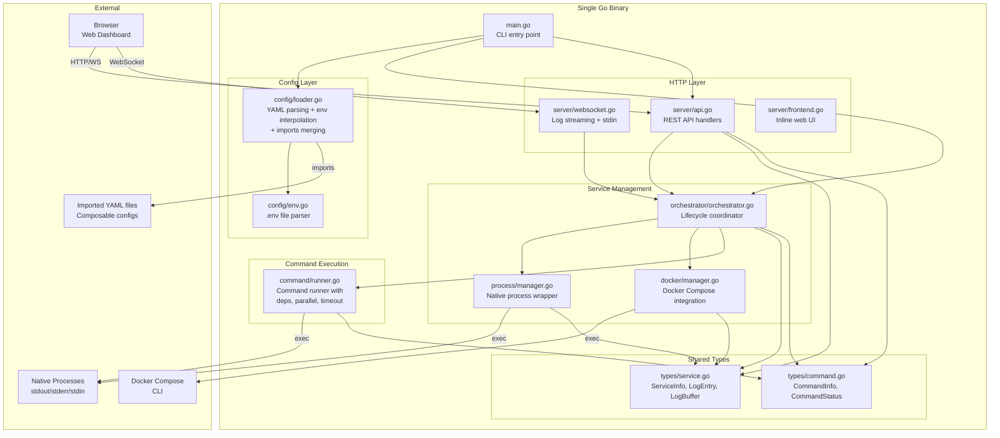
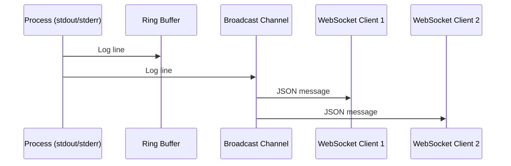
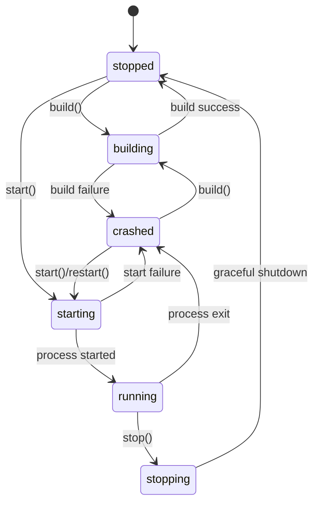
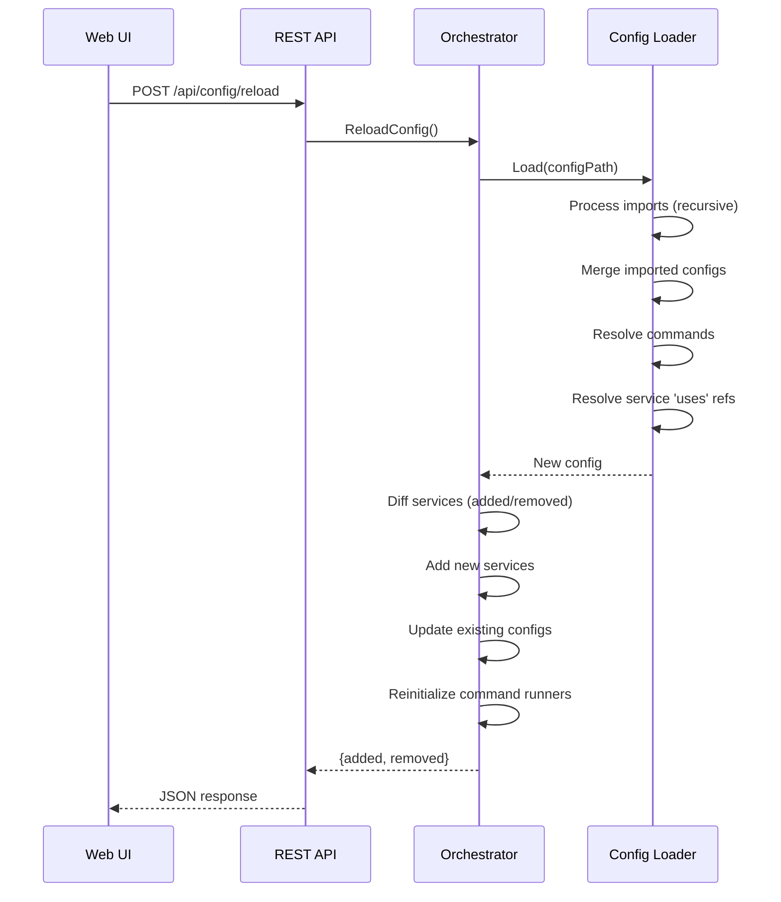
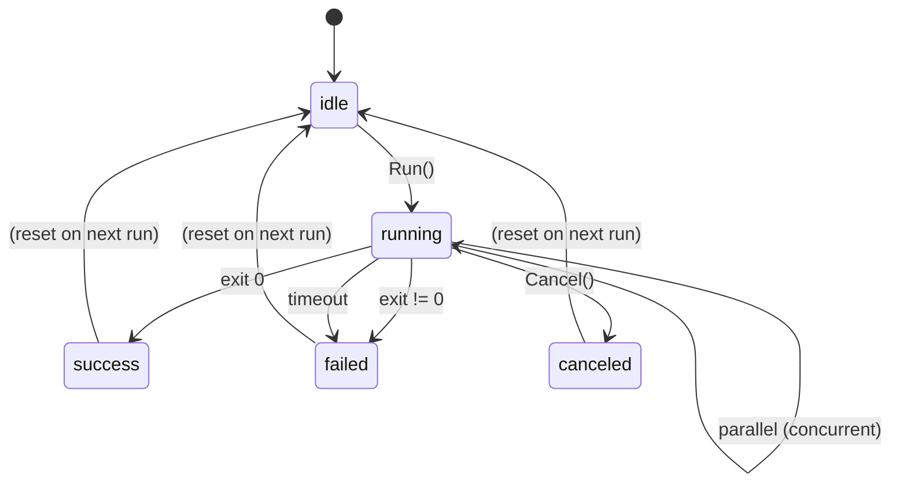

# Foreman Architecture

## Overview

Foreman is a single-binary Go application that manages local development services and commands. It embeds a web UI (inline HTML/JS) and exposes a REST API + WebSocket endpoints for real-time service and command management.

## Architecture Diagram



## Data Flow

### Log Streaming



### Service Lifecycle



### Config Reload



### Command Execution



## Folder Structure

```
foreman/
├── cmd/
│   └── foreman/
│       └── main.go              # Entry point, CLI subcommands (serve/commands/run)
├── internal/
│   ├── config/
│   │   ├── loader.go            # YAML config parser, env interpolation, imports merging
│   │   ├── loader_test.go       # Config parsing tests (25 tests)
│   │   └── env.go               # .env file parser
│   ├── command/
│   │   ├── runner.go            # Command execution engine (deps, parallel, timeout)
│   │   └── runner_test.go       # Command runner tests (16 tests)
│   ├── orchestrator/
│   │   └── orchestrator.go      # Service + command lifecycle coordinator
│   ├── process/
│   │   ├── manager.go           # Native process management (start/stop/stdin/logs)
│   │   ├── proc_unix.go         # Unix-specific process group handling
│   │   └── proc_windows.go      # Windows-specific process handling
│   ├── docker/
│   │   └── manager.go           # Docker Compose integration + auto-discovery
│   ├── server/
│   │   ├── api.go               # REST API routes (services + commands)
│   │   ├── websocket.go         # WebSocket handlers (logs + stdin + command output)
│   │   └── frontend.go          # Inline HTML/JS web dashboard
│   ├── binary/
│   │   ├── downloader.go        # GitHub release binary downloader
│   │   └── downloader_test.go   # Downloader tests
│   └── types/
│       ├── service.go           # ServiceInfo, LogEntry, LogBuffer, status enums
│       └── command.go           # CommandInfo, CommandStatus
├── example-repo/                # Full example project with mock binaries
│   ├── foreman.yaml             # Main config (imports other YAML files)
│   ├── db-commands.yaml         # Database commands (imported)
│   ├── quality-commands.yaml    # Quality/CI commands (imported)
│   ├── .env                     # Shared environment variables
│   ├── mock-bin/                # Mock binaries (npm, node, npx, go, gofmt)
│   ├── frontend/                # Frontend project directory
│   └── backend/cmd/api/         # Backend project directory
├── docs/
│   ├── architecture.md          # This file
│   ├── development.md           # Development guide
│   └── next/
│       └── commands.md          # Commands feature specification
├── .github/
│   ├── copilot-instructions.md  # GitHub Copilot coding guidelines
│   └── workflows/
│       └── release.yml          # Release workflow
├── foreman.example.yaml         # Example configuration
├── go.mod                       # Go module definition
├── go.sum                       # Go dependency checksums
├── install.sh                   # One-liner install script
└── README.md                    # Project README
```

## Component Details

### Config Layer (`internal/config/`)

- **loader.go**: Parses `foreman.yaml`, interpolates `${ENV_VAR:-default}` patterns, resolves relative paths, merges environment variables (root env → service env_file → inline env), resolves build config inheritance. Supports:
  - **Imports**: Recursive loading and merging of imported YAML files with circular detection and depth limiting
  - **Commands**: Parsing of the `commands` block with validation (mutually exclusive `run`/`command`, circular dependency detection)
  - **Platform overrides**: Applies OS-specific command overrides based on `runtime.GOOS`
  - **`uses` references**: Resolves service and build `uses` fields by merging referenced command definitions
- **env.go**: Parses `.env` files (KEY=value format, supports comments and quoted values)

### Command Runner (`internal/command/`)

- **runner.go**: Executes resolved command definitions with:
  - Sequential dependency resolution (`depends_on`)
  - Parallel pre-step execution (`parallel`) via `sync.WaitGroup`
  - Timeout enforcement via `context.WithTimeout`
  - Error tolerance (`ignore_errors`)
  - Cancellation support via context cancellation
  - Log capture with pub/sub for real-time streaming
  - Exit code tracking and duration reporting

### Process Manager (`internal/process/`)

- **manager.go**: Wraps `os/exec.Cmd` with:
  - stdout/stderr capture via goroutines → ring buffer + broadcast
  - stdin pipe for interactive input from web UI
  - Process group management (`Setpgid: true`) for clean signal delivery
  - SIGTERM → wait 10s → SIGKILL shutdown sequence
  - Build command execution with log output

### Docker Manager (`internal/docker/`)

- **manager.go**: Wraps `docker compose` CLI:
  - Auto-discovers services via `docker compose config --services`
  - Maps Docker container states to Foreman status enum
  - Streams logs per sub-service via `docker compose logs -f`
  - Supports individual service start/stop/restart

### Orchestrator (`internal/orchestrator/`)

- **orchestrator.go**: Top-level coordinator:
  - Routes actions to the correct manager (process vs docker vs command)
  - Handles "parent/child" service ID notation for docker sub-services
  - Manages command runners with list, run, cancel, status, and log methods
  - Config reload: diffs services, adds new ones, updates existing configs, reinitializes command runners
  - Auto-start: starts services with `auto_start: true` on launch

### HTTP Server (`internal/server/`)

- **api.go**: REST API with cookie + Bearer token auth. Serves both service and command endpoints.
- **websocket.go**: WebSocket handlers using `golang.org/x/net/websocket` for service logs, stdin, and command output streaming
- **frontend.go**: Serves inline HTML/JS dashboard (no external dependencies needed)

### Types (`internal/types/`)

- **service.go**: Thread-safe `LogBuffer` (ring buffer), `ServiceInfo`, `LogEntry`, service status enums
- **command.go**: `CommandInfo`, `CommandStatus` enums (idle, running, success, failed, canceled)

## Technology Choices

| Choice | Rationale |
|--------|-----------|
| `net/http` (stdlib) | No external router dependency needed for this scale |
| `golang.org/x/net/websocket` | Lightweight WebSocket support without gorilla dependency |
| Inline HTML/JS | Zero frontend build step required; single binary with no external assets |
| `os/exec` for Docker | No Docker SDK dependency; works with any `docker compose` version |
| Ring buffer for logs | In-memory, bounded, fast; services handle their own persistent logging |
