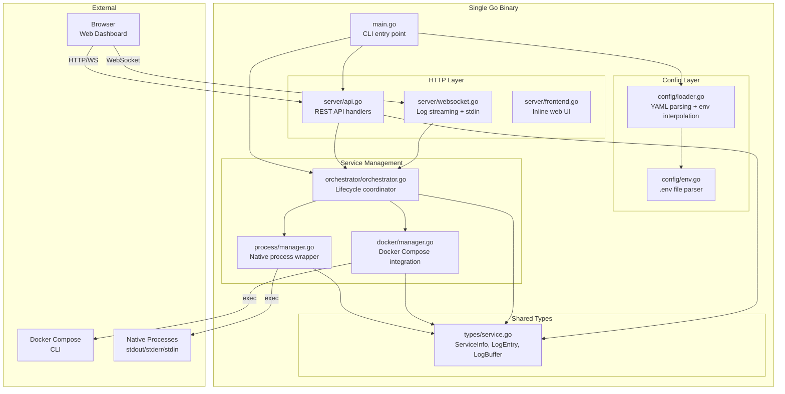
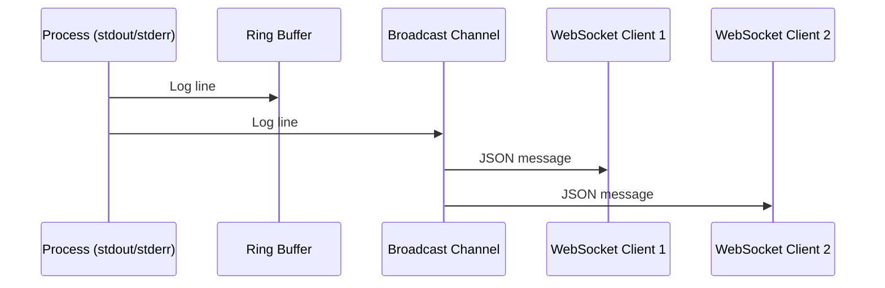
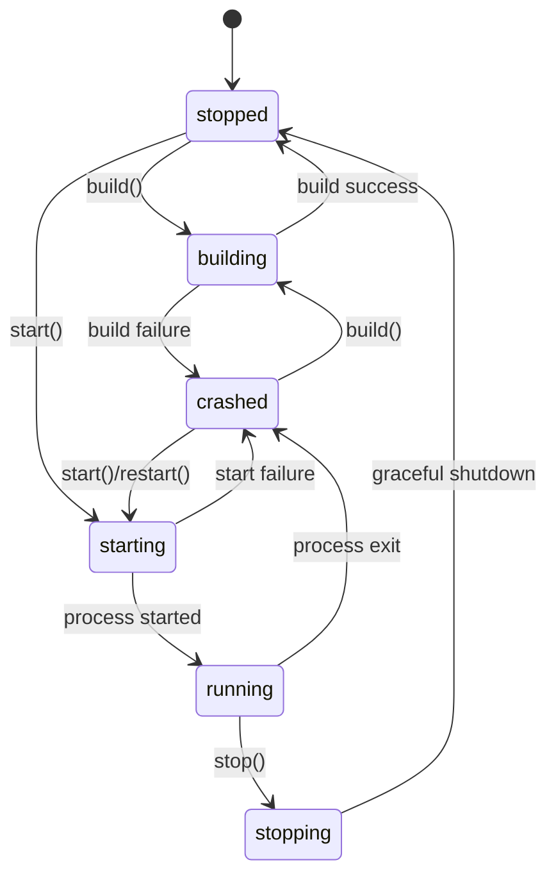
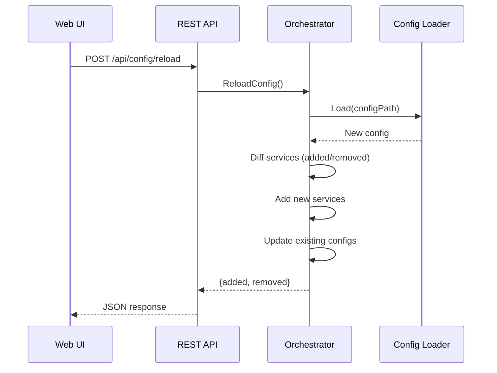

# Foreman Architecture

## Overview

Foreman is a single-binary Go application that manages local development services. It embeds a web UI (inline HTML/JS) and exposes a REST API + WebSocket endpoints for real-time service management.

## Architecture Diagram



## Data Flow

### Log Streaming



### Service Lifecycle



### Config Reload



## Folder Structure

```
tools/foreman/
├── cmd/
│   └── foreman/
│       └── main.go              # Entry point, CLI flags, signal handling
├── internal/
│   ├── config/
│   │   ├── loader.go            # YAML config parser, env var interpolation
│   │   └── env.go               # .env file parser
│   ├── orchestrator/
│   │   └── orchestrator.go      # Service lifecycle coordinator
│   ├── process/
│   │   └── manager.go           # Native process management (start/stop/stdin/logs)
│   ├── docker/
│   │   └── manager.go           # Docker Compose integration + auto-discovery
│   ├── server/
│   │   ├── api.go               # REST API routes and handlers
│   │   ├── websocket.go         # WebSocket handlers (logs + stdin)
│   │   └── frontend.go          # Inline HTML/JS web dashboard
│   └── types/
│       └── service.go           # Shared types (ServiceInfo, LogEntry, LogBuffer)
├── frontend/
│   └── dist/
│       └── index.html           # Placeholder (for go:embed when building with React)
├── docs/
│   ├── architecture.md          # This file
│   └── development.md           # Development guide
├── .vscode/
│   └── commands.sh              # Build and dev commands
├── bin/                         # Build output (gitignored)
├── foreman.example.yaml         # Example configuration
├── go.mod                       # Go module definition
├── go.sum                       # Go dependency checksums
└── README.md                    # Project README
```

## Component Details

### Config Layer (`internal/config/`)

- **loader.go**: Parses `foreman.yaml`, interpolates `${ENV_VAR:-default}` patterns, resolves relative paths, merges environment variables (root env → service env_file → inline env), resolves build config inheritance
- **env.go**: Parses `.env` files (KEY=value format, supports comments and quoted values)

### Process Manager (`internal/process/`)

- **manager.go**: Wraps `os/exec.Cmd` with:
  - stdout/stderr capture via goroutines → ring buffer + broadcast
  - stdin pipe for interactive input from web UI
  - Process group management (`Setpgid: true`) for clean signal delivery
  - SIGTERM → wait 10s → SIGKILL shutdown sequence
  - Build command execution with log output

### Docker Manager (`internal/docker/`)

- **manager.go**: Wraps `docker compose` CLI:
  - Auto-discovers services via `docker compose config --services`
  - Maps Docker container states to Foreman status enum
  - Streams logs per sub-service via `docker compose logs -f`
  - Supports individual service start/stop/restart

### Orchestrator (`internal/orchestrator/`)

- **orchestrator.go**: Top-level coordinator:
  - Routes actions to the correct manager (process vs docker)
  - Handles "parent/child" service ID notation for docker sub-services
  - Config reload: diffs services, adds new ones, updates existing configs
  - Auto-start: starts services with `auto_start: true` on launch

### HTTP Server (`internal/server/`)

- **api.go**: REST API with cookie + Bearer token auth
- **websocket.go**: WebSocket handlers using `golang.org/x/net/websocket`
- **frontend.go**: Serves inline HTML/JS dashboard (no external dependencies needed)

### Types (`internal/types/`)

- **service.go**: Thread-safe `LogBuffer` (ring buffer), `ServiceInfo`, `LogEntry`, status enums

## Technology Choices

| Choice | Rationale |
|--------|-----------|
| `net/http` (stdlib) | No external router dependency needed for this scale |
| `golang.org/x/net/websocket` | Lightweight WebSocket support without gorilla dependency |
| Inline HTML/JS | Zero frontend build step required; single binary with no external assets |
| `os/exec` for Docker | No Docker SDK dependency; works with any `docker compose` version |
| Ring buffer for logs | In-memory, bounded, fast; services handle their own persistent logging |
