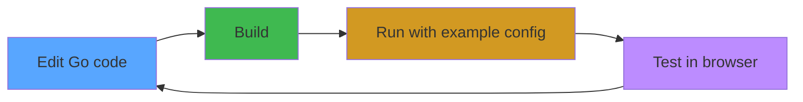

# Foreman Development Guide

## Prerequisites

- **Go 1.22+** (tested with 1.22.12)
- **Docker** (optional, for docker-compose service management)

## Building

### Quick build

```bash
cd tools/foreman
GO111MODULE=on go build -o bin/foreman ./cmd/foreman
```

### Using the dev script

```bash
# From project root
bash .vscode/commands.sh build         # Debug build
bash .vscode/commands.sh build-release # Release build (stripped)
bash .vscode/commands.sh cross-build   # All platforms
```

### Build outputs

```
tools/foreman/bin/
├── foreman                      # Current platform
├── foreman-linux-amd64          # Cross-build outputs
├── foreman-linux-arm64
├── foreman-darwin-amd64
├── foreman-darwin-arm64
└── foreman-windows-amd64.exe
```

## Development Workflow



### 1. Edit code

All Go source is in `internal/` with clear package boundaries:
- `config/` — Change YAML schema or parsing
- `process/` — Change process management behavior
- `docker/` — Change Docker Compose integration
- `orchestrator/` — Change service coordination logic
- `server/` — Change API endpoints or web UI
- `types/` — Change shared data structures

### 2. Build and run

```bash
# Build
bash .vscode/commands.sh build

# Run with example config
cd tools/foreman
./bin/foreman -c foreman.example.yaml
```

### 3. Test

```bash
# Run unit tests
bash .vscode/commands.sh test

# Lint
bash .vscode/commands.sh lint

# Format
bash .vscode/commands.sh fmt
```

### 4. Test API manually

```bash
# Login
curl -X POST http://127.0.0.1:9090/api/auth/login \
  -H 'Content-Type: application/json' \
  -d '{"password":"admin"}'

# Use cookie for subsequent requests
curl http://127.0.0.1:9090/api/services \
  -H 'Cookie: foreman_auth=admin'

# Start a service
curl -X POST http://127.0.0.1:9090/api/service/echo-test/start \
  -H 'Cookie: foreman_auth=admin'

# View logs
curl 'http://127.0.0.1:9090/api/service/echo-test/logs?lines=50' \
  -H 'Cookie: foreman_auth=admin'

# Reload config
curl -X POST http://127.0.0.1:9090/api/config/reload \
  -H 'Cookie: foreman_auth=admin'
```

## Adding a New Feature

### Adding a new API endpoint

1. Add handler in `internal/server/api.go`
2. Register route in `setupRoutes()`
3. Add orchestrator method if needed in `internal/orchestrator/orchestrator.go`
4. Update the inline frontend in `internal/server/frontend.go` if UI changes needed

### Adding a new service type

1. Create a new package under `internal/` (e.g., `internal/kubernetes/`)
2. Implement the service manager interface (Start/Stop/Restart/Logs/Info)
3. Register in the orchestrator's `initServices()` method
4. Add the type to config schema in `internal/config/loader.go`

## Configuration Reference

See [foreman.example.yaml](../foreman.example.yaml) and the [spec document](../../../docs/next/32-local-services-monitor-agent.md) for full schema reference.

## GOPATH Workaround

If your project is inside `$GOPATH`, you need to set `GO111MODULE=on`:

```bash
GO111MODULE=on go build -o bin/foreman ./cmd/foreman
```

The `.vscode/commands.sh` script handles this automatically.
